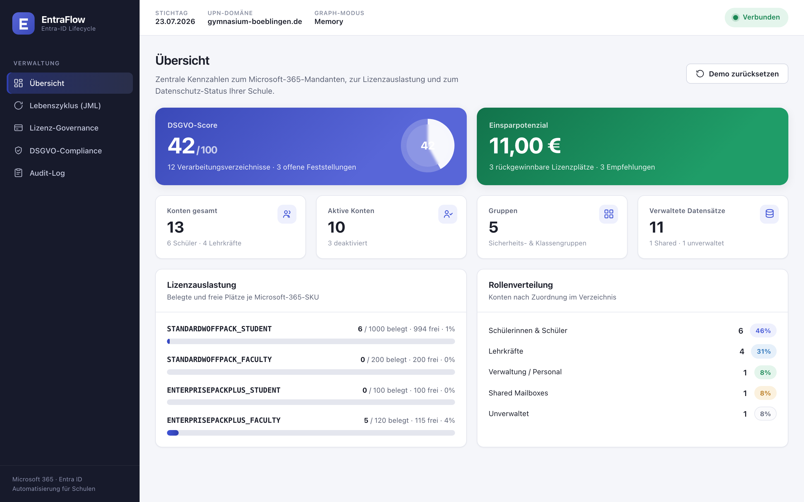
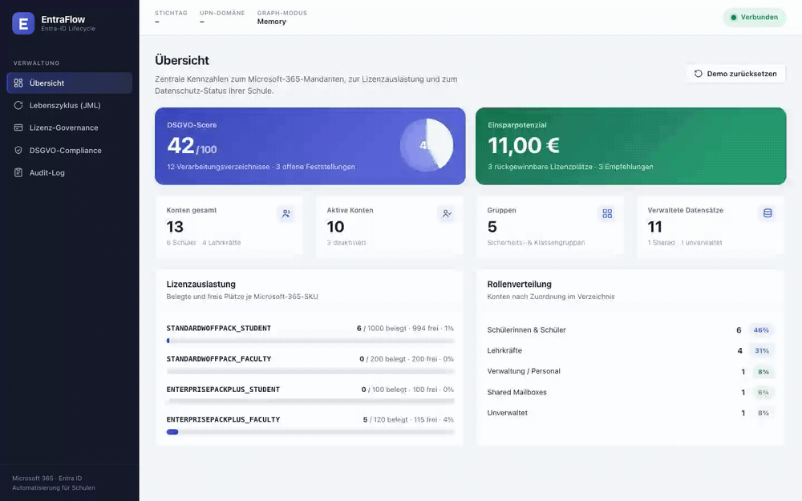
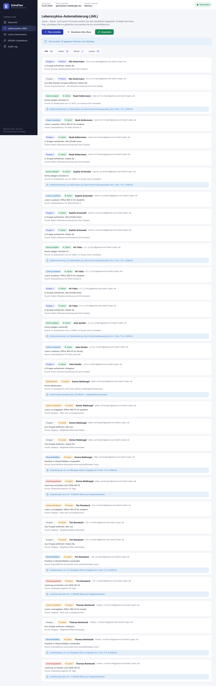
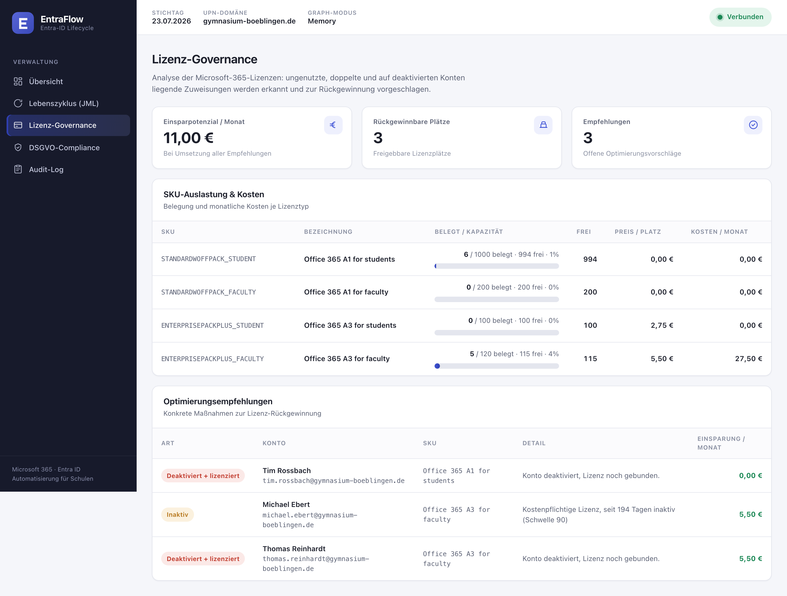
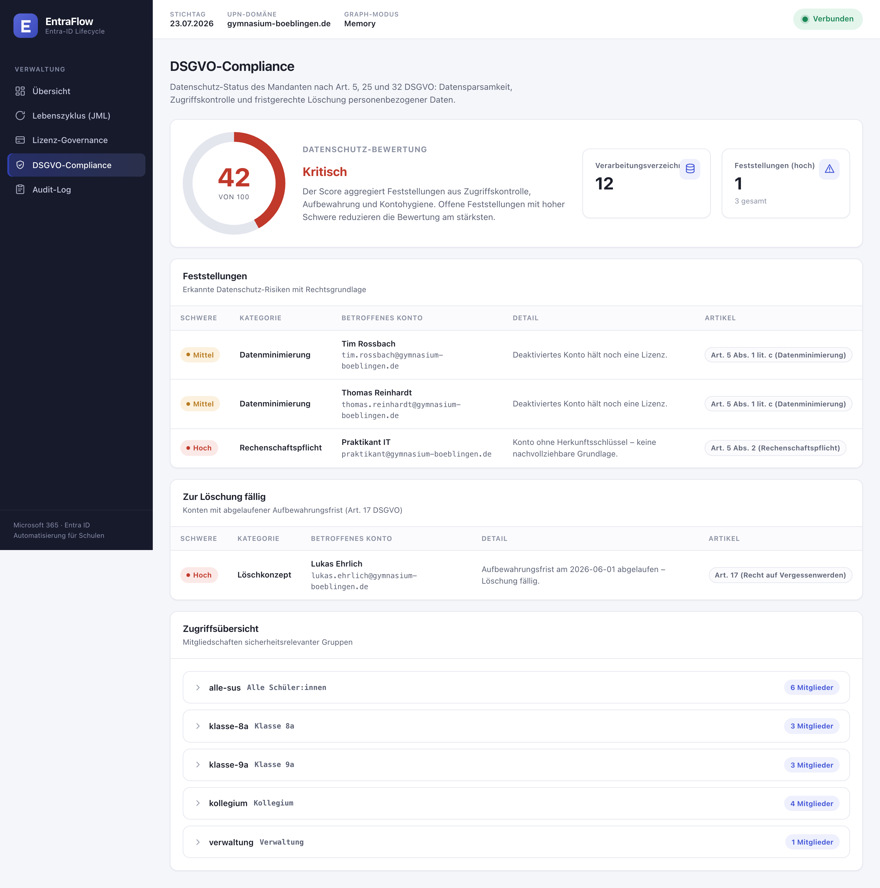
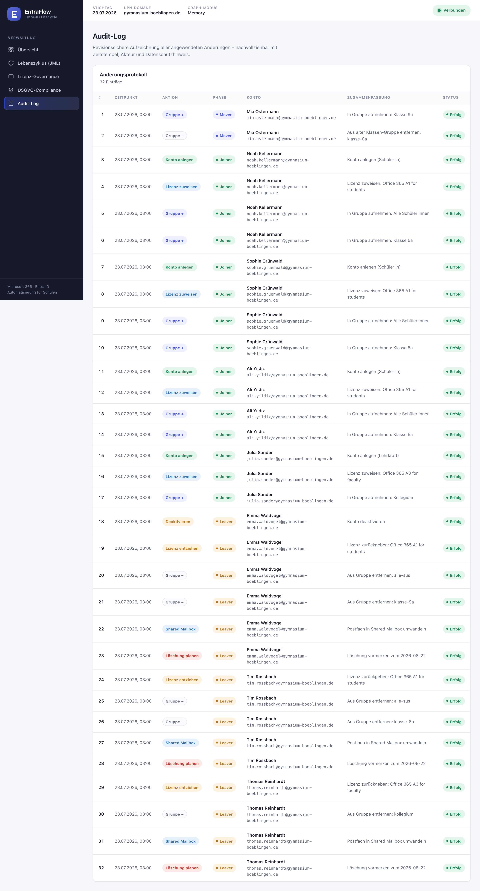
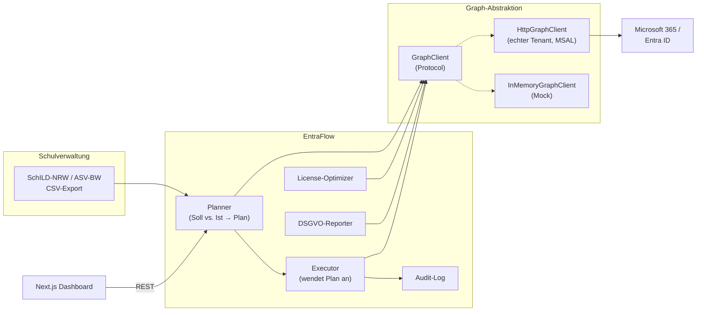

# EntraFlow — Microsoft-365-/Entra-ID-Lebenszyklus für Schulen

> **Joiner · Mover · Leaver automatisiert. Lizenzkosten gesenkt. DSGVO nachgewiesen.**
> Ein deklaratives, quelloffenes Werkzeug, das den Microsoft-365-Tenant einer Schule
> mit dem Schulverwaltungssystem (SchILD-NRW / ASV-BW) in Einklang hält — nach dem
> Prinzip *erst planen, dann anwenden* (`plan` → `apply`), wie man es von Terraform kennt.




---

## Das Problem

Zu jedem Schuljahreswechsel wiederholt sich in der Schul-IT dieselbe Handarbeit:
Hunderte neue Schüler:innen anlegen, Klassenwechsel nachziehen, Abgänger:innen
sauber deaktivieren, Lizenzen zuweisen und wieder einsammeln — und am Ende dem oder
der Datenschutzbeauftragten nachweisen, dass alles rechtskonform passiert ist.

In der Praxis führt das zu drei teuren Dauerproblemen:

| Problem | Folge |
|---|---|
| **Manuelles Onboarding/Offboarding** | Fehleranfällig, langsam, zum Schuljahreswechsel kaum zu bewältigen |
| **„Vergessene" Lizenzen** | Deaktivierte oder inaktive Konten binden kostenpflichtige A3-Seats |
| **Kein Löschkonzept** | Konten von Abgänger:innen bleiben unbegrenzt bestehen — Verstoß gegen Art. 17 DSGVO |

**EntraFlow** löst das: Der Soll-Zustand kommt automatisiert aus dem Schulverwaltungs-
export, der Ist-Zustand aus Microsoft Graph — die Differenz wird als nachvollziehbarer
Plan sichtbar gemacht und erst nach Freigabe angewandt. Jede Änderung landet
revisionssicher im Audit-Log.

---

## Was EntraFlow kann

- 🧩 **Joiner-Mover-Leaver (JML)** — Konten anlegen, Klassen-/Rollenwechsel nachziehen,
  Abgänge sauber abwickeln (deaktivieren → Lizenz zurückgeben → Postfach in Shared
  Mailbox → Löschung nach Frist vormerken).
- 📋 **Plan → Apply** — Der Planer ist rein lesend und gefahrlos wiederholbar; erst der
  Executor schreibt. `dry_run` zeigt jede Änderung, bevor sie passiert. **Nachweisbar idempotent.**
- 💶 **Lizenz-Governance** — findet deaktivierte-aber-lizenzierte, inaktive und
  mehrfach lizenzierte Konten und beziffert die Einsparung in **€/Monat**.
- ⚖️ **DSGVO-Berichte** — Zugriffsübersicht, Datenminimierung, Löschkonzept (Art. 17)
  und ein Verzeichnis von Verarbeitungstätigkeiten (Art. 30) — direkt aus dem echten
  Tenant-Zustand, nicht aus einer Excel-Liste.
- 🔌 **Graph-treu** — die gesamte Logik ist gegen die **echte Microsoft-Graph-v1.0-API**
  programmiert. Der mitgelieferte In-Memory-Mock ist verhaltensgleich; der Wechsel auf
  einen produktiven Tenant ist **reine Konfiguration** (`GRAPH_MODE=graph`).

---

## Demo (30 Sekunden)

Ein kompletter Schuljahreswechsel: Plan erstellen → simulieren (Dry-Run) → anwenden.
Der DSGVO-Score steigt dabei von **42 auf 82**, das Lizenz-Einsparpotenzial sinkt, weil
„vergessene" Seats zurückgegeben werden.



---

## Einblicke

| Lebenszyklus (Plan → Apply) | Lizenz-Governance |
|---|---|
|  |  |
| **Der 32-Aktionen-Plan** — Joiner/Mover/Leaver, jede Aktion mit Begründung und DSGVO-Hinweis. | **11 €/Monat Einsparpotenzial** — inaktive und geleakte Seats werden beziffert. |

| DSGVO-Compliance | Audit-Log |
|---|---|
|  |  |
| **Score, Feststellungen & Löschkonzept** (Art. 5/17/32) direkt aus dem Tenant-Zustand. | **Revisionssicher** — jede angewandte Änderung nachvollziehbar protokolliert. |

---

## Architektur



Die **eine Schnittstelle, zwei Implementierungen** ist der Kern: Weil `Planner`,
`Executor`, `Optimizer` und `DsgvoReporter` ausschließlich gegen das `GraphClient`-Protocol
arbeiten, testet die Demo dieselbe Semantik (inkl. Seat-Kontingente über `subscribedSkus`),
die später im echten Tenant gilt.

```
entraflow/
├── backend/
│   └── app/
│       ├── graph/           # GraphClient-Protocol + Mock + echter HTTP-Client (MSAL)
│       ├── lifecycle/       # planner.py (Reconciliation) · executor.py (Apply)
│       ├── licensing/       # optimizer.py (Kosten-Governance)
│       ├── compliance/      # dsgvo.py (Berichte) · audit.py (Revisionssicherheit)
│       ├── sources/         # csv_source.py (SchILD/ASV-Ingest)
│       ├── policies.py      # Policy-as-Data: Rolle → Lizenz/Gruppen
│       └── api.py / main.py # FastAPI
├── frontend/                # Next.js + TypeScript Dashboard
└── docs/ARCHITECTURE.md
```

---

## Schnellstart

### Variante A — Docker (alles auf einmal)

```bash
docker compose up --build
# Backend  → http://localhost:8000  (Swagger: /docs)
# Frontend → http://localhost:3000
```

### Variante B — lokal

```bash
# Backend
cd backend
python3 -m venv .venv && . .venv/bin/activate
pip install -r requirements.txt
uvicorn app.main:app --reload --port 8000

# Frontend (zweites Terminal)
cd frontend
npm install
npm run dev
```

### Variante C — Konsolen-Demo (ohne Frontend)

```bash
cd backend && . .venv/bin/activate
python -m app.demo
```

---

## Demo-Szenario

Ausgeliefert wird ein realistischer Beispiel-Tenant eines fiktiven *Gymnasiums Böblingen* —
bewusst mit Alt-Lasten: eine seit Monaten inaktive Lehrkraft, deaktivierte-aber-lizenzierte
Konten, ein herrenloses Konto ohne Herkunft und ein zur Löschung fälliges Konto.

Der Schuljahreswechsel-Export erzeugt daraus diesen Plan:

```
 Joiner: 15   Mover: 2   Leaver: 15   Gesamt: 32 Aktionen

 JOINER  → 3 neue SuS (Klasse 5a) + 1 Lehrkraft: Konto, A1/A3-Lizenz, Gruppen
 MOVER   → Mia Ostermann: Klasse 8a → 9a (Gruppen umgezogen)
 LEAVER  → Emma, Tim, Thomas: deaktiviert, Lizenz zurück, Shared Mailbox,
           Löschung vorgemerkt zum 2026-08-22 (Art. 17 DSGVO)
```

**Wirkung — vorher/nachher:**

| Kennzahl | vor dem Lauf | nach dem Lauf |
|---|---:|---:|
| DSGVO-Score | **42 / 100** | **82 / 100** |
| Offene Datenschutz-Befunde | 3 | 1 |
| Einsparpotenzial Lizenzen | **11,00 €/Monat** | 5,50 €/Monat¹ |
| Rückgewinnbare Seats | 3 | 1 |
| Erneuter Plan-Lauf | — | **0 Aktionen (idempotent)** |

<sub>¹ Der verbleibende Betrag ist eine echte Governance-Empfehlung (eine real inaktive
Lehrkraft), die bewusst *nicht* automatisch entzogen, sondern zur Prüfung vorgelegt wird.</sub>

---

## Microsoft-Graph-Treue

Die Datenformen und Operationen bilden Microsoft Graph v1.0 exakt ab:

| EntraFlow-Operation | Microsoft-Graph-Endpunkt |
|---|---|
| Konto anlegen | `POST /users` |
| Aktivieren/Deaktivieren | `PATCH /users/{id}` (`accountEnabled`) |
| Lizenz zuweisen/entfernen | `POST /users/{id}/assignLicense` |
| Gruppe anlegen / Mitglied hinzufügen | `POST /groups` · `POST /groups/{id}/members/$ref` |
| Kontingente lesen | `GET /subscribedSkus` |
| Inaktivität ermitteln | `signInActivity.lastSignInDateTime` |

Der produktive `HttpGraphClient` authentifiziert per **OAuth2-Client-Credentials-Flow**
(App-Registrierung in Entra ID) und benötigt die Application-Permissions
`User.ReadWrite.All`, `Group.ReadWrite.All`, `Organization.Read.All`, `AuditLog.Read.All`.

---

## DSGVO by design

| DSGVO-Grundsatz | Umsetzung in EntraFlow |
|---|---|
| **Art. 5 (1c) Datenminimierung** | Nur Stammdaten aus dem Quellsystem; deaktivierte-aber-lizenzierte Konten werden gemeldet |
| **Art. 5 (2) Rechenschaftspflicht** | Jede Änderung im Audit-Log; herrenlose Konten (ohne Herkunftsschlüssel) werden markiert |
| **Art. 17 Recht auf Vergessenwerden** | Löschkonzept: Abgänger-Konten werden nach konfigurierbarer Frist zur Löschung vorgemerkt |
| **Art. 30 Verzeichnis von Verarbeitungstätigkeiten** | Zugriffsübersicht (wer ist in welcher Gruppe) + Anzahl verarbeiteter Datensätze |
| **Art. 32 Integrität/Vertraulichkeit** | Zugriff wird beim Abgang sofort entzogen (Deaktivierung vor Löschung) |

---

## Tests & Qualität

```bash
cd backend && . .venv/bin/activate && python -m pytest
# 32 passed
```

Abgedeckt sind u. a. Joiner/Mover/Leaver-Logik, **Idempotenz** (zweiter Lauf = 0 Aktionen),
Seat-Kontingente, Lizenz-Optimierung (inkl. Vermeidung von Fehlalarmen bei frischen Konten),
DSGVO-Befunde und die komplette HTTP-API. CI läuft über GitHub Actions (Backend-Tests +
Frontend-Build).

---

## Roadmap

- [ ] Anbindung echter SchILD-NRW-/ASV-BW-Schnittstellen (statt CSV)
- [ ] Delta-Webhooks (Graph `subscriptions`) statt periodischem Abgleich
- [ ] Genehmigungs-Workflow (4-Augen-Prinzip) vor `apply`
- [ ] Export des DSGVO-Berichts als signiertes PDF für die/den Datenschutzbeauftragte:n

---

## Autor

**Haydar Kozat** — Schul-IT-Spezialist & IT-Systemadministrator
16 Jahre Erfahrung im Aufbau und Betrieb schulischer IT (Microsoft 365, MDM, ~5.000 Nutzer:innen).
[LinkedIn](https://www.linkedin.com/in/haydar-kozat) · [GitHub](https://github.com/haydarkozat)

> EntraFlow ist ein Portfolio-Projekt und bewusst self-hosted & datensouverän ausgelegt —
> im Sinne der Anforderungen deutscher Schulträger und des DigitalPakts Schule.
